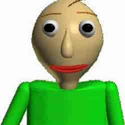
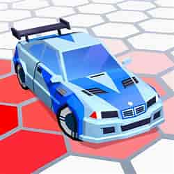
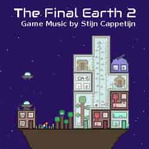
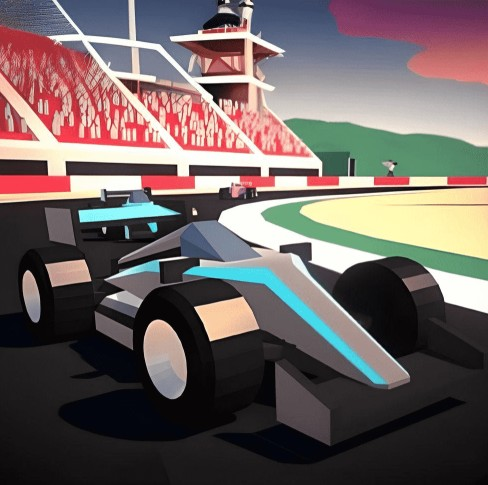
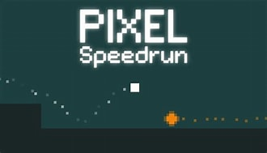

<!DOCTYPE html>
<html lang="en">
<head>
    <meta charset="UTF-8">
    <meta name="viewport" content="width=device-width, initial-scale=1.0">
    <title>Home Page</title>
    <link rel="stylesheet" href="styles.css">
    <link href="https://fonts.googleapis.com/css2?family=Unbounded:wght@900&display=swap" rel="stylesheet">
    
</head>
<body>
    <header>
        

            <a href="HomePage.html">
                Fun-Fri
            </a>
        

        <nav>
            <a href="Activities.html">Games</a>
            <a href="Apps.html">Apps</a>
            <a href="Extra.html">Extras</a>
        </nav>
    </header>

    

        
Fun-Fri

        
Happy New Year!

        
↓

        
<strong>PLEASE NOTE:</strong> This platform is not to be used during instructional teaching time, and violating this rule will cause this website to have limited access!

        
Questions or Suggestions? Email me at <a href="mailto:funfribusiness@gmail.com" class="email-link">funfribusiness@gmail.com</a>

        
Share with friends! URL: <a href="https://tinyurl.com/funfri25" class="tinyurl-link">tinyurl.com/funfri25</a>

        
Want to search games? Just press "ctrl f" on your keyboard!

    

    <main>
        

            <a href="Baldi.html" class="game-widget">
                
                
Baldi Basics

            </a>
            <a href="GeforceNow.html" class="game-widget">
                
                
Fortnite

            </a>
            <a href="CarKingArena.html" class="game-widget">
                
                
Car King Arena

            </a>
            <a href="Roblox.html" class="game-widget">
                
                
Roblox

            </a>
            <a href="FInalearth.html" class="game-widget">
                
                
The Final Earth 2

            </a>
            <a href="Granny.html" class="game-widget">
                
                
Granny

            </a>
            <a href="PolyTrack.html" class="game-widget">
                
                
Poly Track

            </a>
            <a href="PixelSpeedrun.html" class="game-widget">
                
                
Pixel Speedrun

            </a>
        

    </main>
    
    </script>
</body>
</html>
